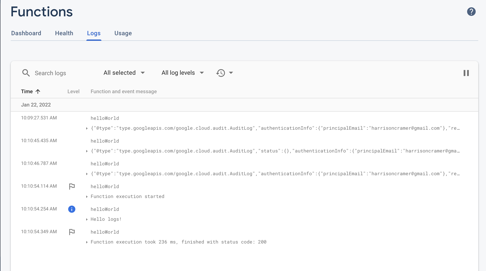

In my humble opinion, functions as a service represent are by far the most convenient way to build web scrapers.

Simply call out to an API, and your service runs: No fussing with infrastructure, schedules, or anything of that nature.

Google's mobile platform <a href="https://firebase.google.com/">Firebase</a> is typically used to build mobile applications, not web scrapers. But in fact the platform comes with features that make it perfect for simple web scraping. This post will show you how to deploy a web scraper to Firebase and to enable real-time alerts whenever new data is obtained.

## What are we building?

This blog will show you how to build a web scraper that trawls a URL and checks for updates every 5 minutes. Whenever something changes, Twilio will send a text with the details to your number.

## Setting up the project

You'll first need to install the Firebase CLI tools, which can be added via NPM.

```
$ npm i -g firebase-tools
```

Create a firebase account online, and then connect the CLI.


```
$ firebase login
```

Once this is done, we can initialize a new project. Create a new folder, and initialize it as a git repository,  and then run the `firebase init` command.

```
$ mkdir my-dummy-scrapers
$ cd my-dummy-scrapers
$ git init
$ firebase init
```

The prompt will ask us which features we'd like to set up for our repository. We should choose the realtime database, which we'll use to store our data, and functions, which we'll use to run our web scrapers. We'll also be creating the project from within the CLI, because it's easier, so pick that option and give your project an ID and name.

This should take a minute. 

It will then ask whether you'd like to initialize a realtime database to go along with your project. Select "yes" and pick the default prompts for creating security rules.

Once that's done, you'll be asked to configure a number of other features (Typescript vs. Javascript, ESLint, etc) which are not crucial. I'm picking Typescript and installing all my dependencies with NPM. At the end of this process, you'll have a folder which contains all of your code for the project, like this:

```
$ ls -l
.firebaserc
.git
.gitignore
database.rules.json
firebase.json
functions
```

The `functions` directory is where we'll write our code.


## Deploying Firebase functions

Switch into the firebase folder and open up the `src/index.ts` file. This is where we'll write our web scraper functions. 

> Firebase requires that your project be on the "Blaze" plan in order to run these functions. It's super simple to upgrade, but annoying. You have to do it in the Firebase console, and will get prompted with an error later if you try to deploy without upgrading. Just to put things in perspective, I've got a scraper that runs two functions every 5 minutes. It's been running for a week, and has cost me six cents.

The deployment process for this is super simple: Just write a function, and export it as as constant like you would with any other ES module. 

```typescript:title=index.ts
import * as functions from "firebase-functions";

export const helloWorld = functions.https.onRequest((request, response) => {
  functions.logger.info("Hello logs!", {structuredData: true});
  response.send("Hello from Firebase!");
});
```

We can now deploy this function to firebase from the shell. Switch back into the root directory of the project, and run the deploy command:

```
$ cd ../
$ firebase deploy --only functions
=== Deploying to 'my-dummy-scraper'...

i  deploying functions
Running command: npm --prefix "$RESOURCE_DIR" run lint

> lint
> eslint --ext .js,.ts .

Running command: npm --prefix "$RESOURCE_DIR" run build

> build
> tsc

✔  functions: Finished running predeploy script.
i  functions: ensuring required API cloudfunctions.googleapis.com is enabled...
i  functions: ensuring required API cloudbuild.googleapis.com is enabled...
i  functions: ensuring required API artifactregistry.googleapis.com is enabled...
⚠  functions: missing required API artifactregistry.googleapis.com. Enabling now...
✔  functions: required API cloudfunctions.googleapis.com is enabled
⚠  functions: missing required API cloudbuild.googleapis.com. Enabling now...
✔  functions: required API artifactregistry.googleapis.com is enabled
✔  functions: required API cloudbuild.googleapis.com is enabled
i  functions: preparing functions directory for uploading...
i  functions: packaged functions (90.06 KB) for uploading
✔  functions: functions folder uploaded successfully
i  functions: creating Node.js 16 function helloWorld(us-central1)...
✔  functions[helloWorld(us-central1)] Successful create operation.
Function URL (helloWorld(us-central1)): https://us-central1-my-dummy-scraper.cloudfunctions.net/helloWorld
i  functions: cleaning up build files...

✔  Deploy complete!

Project Console: https://console.firebase.google.com/project/my-dummy-scraper/overview
```

Once the function is deployed, we should be able to go to this endpoint, and see "Hello, world" in the browser. Awesome!

## Firebase "Schedule" Functions

Setting up APIs is all fine and dandy, but we want to use Firebase for web scraping. 

Luckily, the platform comes with another feature that makes running jobs on a schedule super simple: <a href="https://firebase.google.com/docs/functions/pubsub-events">pubsub</a> triggers.

Normally, you'd use the pubsub function to run some arbitrary code whenever a certain event occurs, but you can also use the functions to run some arbitrary code every 10 or 5 minutes. That's what we'll do to run our scraper, via the <a href="https://firebase.google.com/docs/reference/functions/providers_pubsub#schedule">schedule</a> method. 

Let's create a new function.

```typescript:title=index.ts
import * as functions from "firebase-functions";
export const helloEveryFiveMinutes = functions.pubsub
    .schedule("every 5 minutes")
    .onRun(() => {
      console.log("Hello from Firebase!");
    });
```

Redeploy the functions with `firebase deploy --only functions` from the root of your project. When this deploy runs, Firebase will automatically detect the old "hello world" function is no longer in our code, and will delete it, in addition to deploying our new function. In this way, you can think of Firebase functions a bit like other "stateful" approaches to infrastructure as code: Whatever is defined in your files will also be reflected in your production environment, and nothing more. In the future, changes to these functions will be applied to our cloud environment.

<p class="tip">Firebase will update outdated functions whenever you change the code and redeploy. It can't do that in our case, however, because we wrote an HTTP function the first time and a schedule function the second time. 

We've written "every five minutes" for simplicity here, but the `schedule` callback actually supports CRON syntax, which is a simple way to write timers. I'd recommend playing around with <a href="https://crontab.guru/">this</a> tool if you need to run functions on certain days or times.

These logs are visible in the firebase console. Log into your project, and head to the functions page, and to the logs tab. My logs look like this:



## The business logic 📊

First, use <a href="https://www.npmjs.com/package/dotenv">dotenv</a> to pull in any variables we need from our environment files (I've got a .env in the root of my project). Then we're initializing our Firebase app. This connects our application to Firebase in the cloud.

```typescript:title=index.ts
import { config } from "dotenv";
import { initializeApp } from "firebase/app";

config();

const firebaseConfig = {
  apiKey: process.env.FIREBASE_API_KEY,
  authDomain: "your-auth-domain-here"
  databaseURL: "your-db-url",
  projectId: "your-scraper-name",
  storageBucket: "your-storage-bucket",
  messagingSenderId: "1026774728634",
  appId: "1:1026774728634:web:d76a3326fb26a9e376a783",
};

initializeApp(firebaseConfig);
```


Next, I'm initializing the function to run every five minutes, logging the start of the function and the time, and making an axios GET call to the URL of my website.

Notice that I'm using axios and have to destructure the data off of the response.

```typescript{1,2,20-29}:title=index.ts
import * as functions from "firebase-functions";
import axios from "axios";
import { config } from "dotenv";
import { initializeApp } from "firebase/app";

config();

const firebaseConfig = {
  apiKey: process.env.FIREBASE_API_KEY,
  authDomain: "your-auth-domain-here"
  databaseURL: "your-db-url",
  projectId: "your-scraper-name",
  storageBucket: "your-storage-bucket",
  messagingSenderId: "1026774728634",
  appId: "1:1026774728634:web:d76a3326fb26a9e376a783",
};

initializeApp(firebaseConfig);

export const getPosts = functions.pubsub
  .schedule("every 5 minutes")
  .onRun(async () => {
    const date = new Date().toISOString();
    console.log(`Getting posts at ${date}....`);

    const { data } = await axios.get("https://harrisoncramer.me/blog");

```

Next, we have to connect to Firebase's real-time database. Just import the `getDatabase` function and call it. We'll also make a function for storing our link in the DB.

```typescript{2,29,31-40}:title=index.ts
import * as functions from "firebase-functions";
import { getDatabase, ref, set } from "firebase/database";
import axios from "axios";
import { config } from "dotenv";
import { initializeApp } from "firebase/app";

config();

const firebaseConfig = {
  apiKey: process.env.FIREBASE_API_KEY,
  authDomain: "your-auth-domain-here"
  databaseURL: "your-db-url",
  projectId: "your-scraper-name",
  storageBucket: "your-storage-bucket",
  messagingSenderId: "1026774728634",
  appId: "1:1026774728634:web:d76a3326fb26a9e376a783",
};

initializeApp(firebaseConfig);

export const getPosts = functions.pubsub
  .schedule("every 5 minutes")
  .onRun(async () => {
    const date = new Date().toISOString();
    console.log(`Getting posts at ${date}....`);

    const { data } = await axios.get("https://harrisoncramer.me/blog");

    const db = getDatabase();

    async function storePost(id: string, link: string) {
      console.log(`Saving ${link}`);
      const reference = ref(db, "posts/" + id);
      try {
        await set(reference, { link });
      } catch (err) {
        console.log(`There was an error saving the ${link}`);
        console.error(err);
      }
    }

```


This function will require an "ID" for each link, because I generally prefer to use random strings to store items in a DB. Here's the hashing function I'm using to turn those links into IDs.

```typescript{5,22-23}:title=index.ts
import * as functions from "firebase-functions";
import { getDatabase, ref, set } from "firebase/database";
import axios from "axios";
import { config } from "dotenv";
import crypto from "crypto"
import { initializeApp } from "firebase/app";

config();

const firebaseConfig = {
  apiKey: process.env.FIREBASE_API_KEY,
  authDomain: "your-auth-domain-here"
  databaseURL: "your-db-url",
  projectId: "your-scraper-name",
  storageBucket: "your-storage-bucket",
  messagingSenderId: "1026774728634",
  appId: "1:1026774728634:web:d76a3326fb26a9e376a783",
};

initializeApp(firebaseConfig);

const hashingFunc = (str: string) =>
  crypto.createHash("sha256").update(str, "utf8").digest("hex");

export const getPosts = functions.pubsub
  .schedule("every 5 minutes")
  .onRun(async () => {
    const date = new Date().toISOString();
    console.log(`Getting posts at ${date}....`);

    const { data } = await axios.get("https://harrisoncramer.me/blog");

    const db = getDatabase();

    async function storePost(id: string, link: string) {
      console.log(`Saving ${link}`);
      const reference = ref(db, "posts/" + id);
      try {
        await set(reference, { link });
      } catch (err) {
        console.log(`There was an error saving the ${link}`);
        console.error(err);
      }
    }
```

Finally, we'll use Cheerio to load our data and parse it. Cheerio returns an "array-like" structure instead of an array, which can make working with that data cumbersome, so we'll covert our data to a Javascript array.

This is a bit of a contrived example, because I'm only grabbing all the h2 elements. Normally, Cheerio's benefit comes in when working with a more complex website. For instance, with <a href="https://github.com/harrisoncramer/streetsleazy/blob/main/functions/src/index.ts#L114">this code</a> from a Street Easy real estate listings scraper.

```typescript{4,47-48}:title=index.ts
import * as functions from "firebase-functions";
import { getDatabase, ref, set } from "firebase/database";
import axios from "axios";
import cheerio from "cheerio"
import { config } from "dotenv";
import crypto from "crypto"
import { initializeApp } from "firebase/app";

config();

const firebaseConfig = {
  apiKey: process.env.FIREBASE_API_KEY,
  authDomain: "your-auth-domain-here"
  databaseURL: "your-db-url",
  projectId: "your-scraper-name",
  storageBucket: "your-storage-bucket",
  messagingSenderId: "1026774728634",
  appId: "1:1026774728634:web:d76a3326fb26a9e376a783",
};

initializeApp(firebaseConfig);

const hashingFunc = (str: string) =>
  crypto.createHash("sha256").update(str, "utf8").digest("hex");

export const getPosts = functions.pubsub
  .schedule("every 5 minutes")
  .onRun(async () => {
    const date = new Date().toISOString();
    console.log(`Getting posts at ${date}....`);

    const { data } = await axios.get("https://harrisoncramer.me/blog");

    const db = getDatabase();

    async function storePost(id: string, link: string) {
      console.log(`Saving ${link}`);
      const reference = ref(db, "posts/" + id);
      try {
        await set(reference, { link });
      } catch (err) {
        console.log(`There was an error saving the ${link}`);
        console.error(err);
      }
    }

    const $ = cheerio.load(data);
    const links = Array.from($("h2")).map(el => $(el).text())

```

Finally, we'll iterate over our values and save them to the Database. The DB will save any new records and ignore repeats. Don't forget to close your DB connection when you're done! 

The whole function looks like this:

```typescript:title=index.ts
import * as functions from "firebase-functions";
import axios from "axios";
import cheerio from "cheerio";
import { config } from "dotenv";
import { getDatabase, ref, goOffline, set } from "firebase/database";
import crypto from "crypto";
import { initializeApp } from "firebase/app";

config();

const firebaseConfig = {
  apiKey: process.env.FIREBASE_API_KEY,
  authDomain: "your-auth-domain-here"
  databaseURL: "your-db-url",
  projectId: "your-scraper-name",
  storageBucket: "your-storage-bucket",
  messagingSenderId: "1026774728634",
  appId: "1:1026774728634:web:d76a3326fb26a9e376a783",
};

initializeApp(firebaseConfig);

const hashingFunc = (str: string) =>
  crypto.createHash("sha256").update(str, "utf8").digest("hex");

initializeApp(firebaseConfig);

export const getPosts = functions.pubsub
  .schedule("every 5 minutes")
  .onRun(async () => {
    const date = new Date().toISOString();
    console.log(`Getting posts at ${date}....`);

    const { data } = await axios.get("https://harrisoncramer.me/blog");

    const db = getDatabase();

    async function storePost(id: string, link: string) {
      console.log(`Saving ${link}`);
      const reference = ref(db, "posts/" + id);
      await set(reference, { link });
    }

    const $ = cheerio.load(data);
    const links = Array.from($("h2"));

    const saves = posts.map(post => storePost(post))
    await Promise.all(saves)
    console.log("Posts saved!");

    goOffline(db);

    console.log("Done!");
  });
```

Redeploy your function to firebase, and you should now see the database fill up with all of your data. This function will check that page for any updates every five minutes, and whenever a new post is published, will add it to the database.

This doesn't seem so amazing all by itself. The reason that we're using Firebase, though, is we can trigger events whenever a scraper writes to our DB!

## Firebase "Database" Functions

We can automatically trigger code to run whenever something touches our database with Firebase database functions. The database function is the last type of function that we'll need to write our application.

Our DB function will send a text via Twilio every time a write occurs to our databse.

<p class="tip">It's worth noting here, that you can also do update functions, to see when data changes.</p>

Before writing this final function, let's do a quick refactor, and split our code into a few different files. I'm going tol 

First, create a new function to export. The "ref" in this case is the method that lets us determine where in our DB we'd like to "watch," and the `onCreate()` method will run a callback function whenever anyone writes to that location.

Finally, we're using the `snapshot.val()` function, which will return to us the value of the given ref from the DB. This is an object, so we can destructure the link property that we set earlier.

```typescript:title=index.ts
export const onCreatedPost = functions.database
  .ref("/post/{id}")
  .onCreate(async (snapshot, context) => {
    const id = context.params.id;

    console.log(`${id} was created.`);

    const { link } = snapshot.val();

```

The ID here refers to the ID of the top-level field where we're saving this object. It's kind of like a query string.

You can read more about these different methods and what they do <a href="https://firebase.google.com/docs/reference/functions/providers_database.refbuilder#on-create">here</a>.

Now that we've triggered our code, we need to send a text.

## Sending a text with Twilio

This is the simplest part of the application. Sign up for a Twilio account, and make sure that you have verified your number. By default, you can only send texts to yourself, although if you pay you can send texts to other numbers too.

We're pulling the variables required to connect to Twilio from our `.env` file.

```typescript{10-26}:title=index.ts
export const onCreatedPost = functions.database
.ref("/posts/{id}")
.onCreate(async (snapshot, context) => {
  const id = context.params.id;

  console.log(`${id} was created.`);

  const { link } = snapshot.val();

  const { TWILIO_AUTH_TOKEN, TWILIO_ACCOUNT_SID, TWILIO_PHONE, PHONE } = process.env;

  const client = twilio(TWILIO_ACCOUNT_SID, TWILIO_AUTH_TOKEN);

  try {
    await client.messages.create({
      body: `New link posted: ${link}`,
      from: `${TWILIO_PHONE}`,
      to: `${PHONE}`,
    });
  } catch (err) {
    console.error("Could not send text!")
    console.error(err)
  }

  console.log(`Messages sent at ${new Date().toISOString()}!`);
});
```

That's it! Redeploy the function, and you should start to recieve texts whenever a new post is made. 

The full code for this (as well as a more complex example) can be found <a href="https://github.com/harrisoncramer/streetsleazy/tree/blog-scraper">here</a>.
