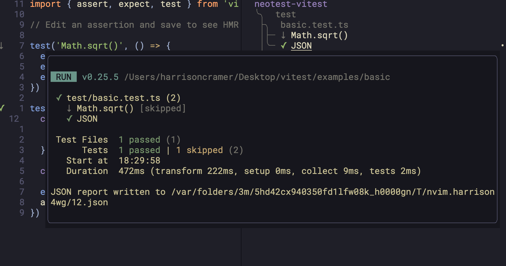
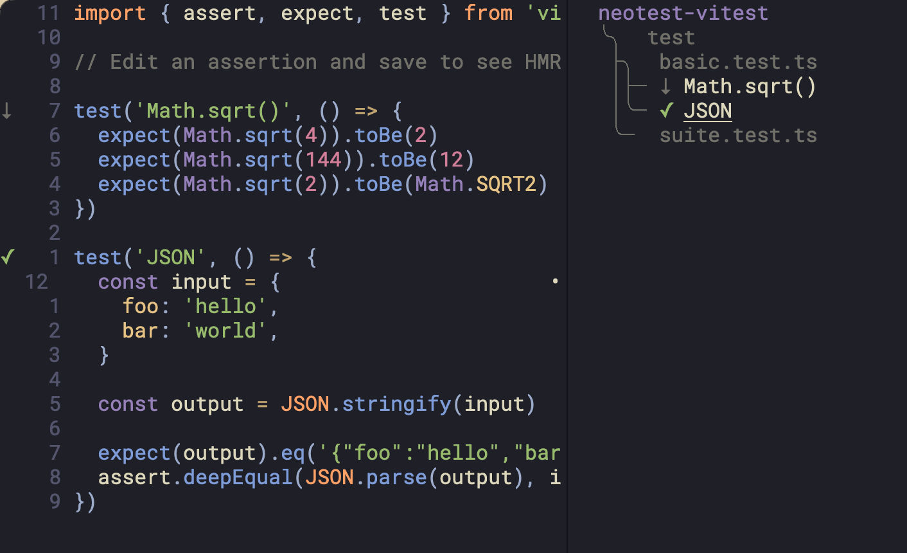
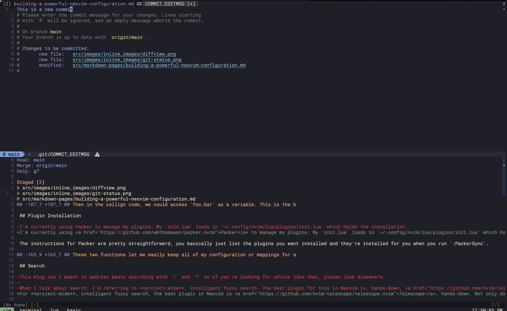
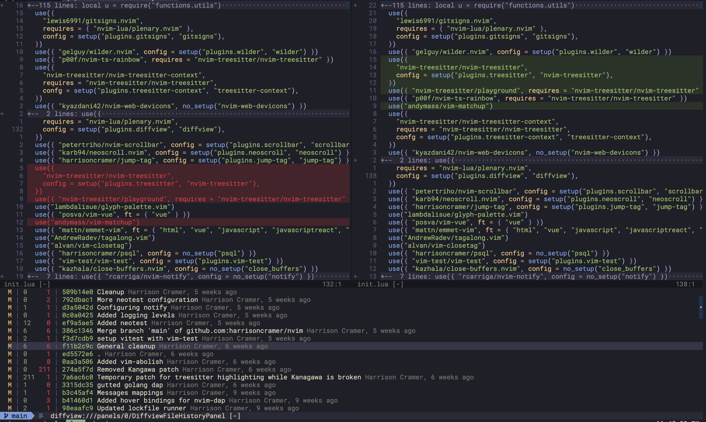

I've been using Neovim as my primary editor for about three years. In that short time span, the editor and community surrounding the tool has undergone a dizzying amount of change. People moved onto Lua, the core team integrated LSPs directly into the editor, and the plugin ecosystem exploded. Much like the ever-changing frontend world, it can be hard to keep up. I hope this post gives a few signposts for folks building out their own editors.

My configuration that I'll reference throughout this post is <a href="https://www.github.com/harrisoncramer/neovim">here</a>.

Of course, your mileage may vary -- things that work for me might not for you. The beauty of Neovim is that it's _so_ configurable, that there's always more than one way to do something. If you've got ideas on how I can improve my own workflow, or plugins I should try, please drop a comment below! 

## Lua Modules
 
This isn't Neovim specific, but I think it's important to make sure we understand Lua modules before going any further, because they're at the heart of most Neovim configurations and modern plugins.

When Neovim first loads it'll pick up your `init.lua` located in your standard path, for me `~/.config/nvim`. If you aren't sure where this is, run the following Ex-command:

```lua
:lua print(vim.fn.stdpath('config'))
```

I prefer to keep this initial file as simple as possible. Mine just loads another series of modules that contain different parts of my configuration:

```lua
-- Neovim Core Settings
require("settings")

-- Language Servers
require("lsp")

-- Settings, Mappings, Keybindings
require("colorscheme")
require("functions")
require("autocommands")
require("commands")

-- Plugins
require("plugins")

-- Mappings
require("mappings")
```

When resolving these imports, Lua will automatically look for a `lua` directory in your config path, at `~/.config/nvim/lua`, and will look for a file that matches the given name. If it cannot find a file, it'll look for a directory with an `init.lua` inside it (if you're familiar with Javascript, this is equivalent to the way JS will resolve an `index.js` file inside of a directory).

For instance, my folder structure (basically) looks like this:

```terminal
$ pwd 
~/.config/nvim
$ ls
lua
after
init.lua
plugin
$ cd lua
$ ls -la
drwxr-xr-x  10 harrisoncramer  staff   320 Dec  3 12:16 .
drwxr-xr-x  17 harrisoncramer  staff   544 Dec  5 22:20 ..
-rw-r--r--   1 harrisoncramer  staff   481 Nov 19 21:18 autocommands.lua
-rw-r--r--   1 harrisoncramer  staff  2026 Nov 19 21:18 colorscheme.lua
-rw-r--r--   1 harrisoncramer  staff  3268 Dec  3 12:16 commands.lua
drwxr-xr-x   4 harrisoncramer  staff   128 Dec  3 12:18 functions
drwxr-xr-x   6 harrisoncramer  staff   192 Dec  3 12:16 lsp
-rw-r--r--   1 harrisoncramer  staff  2506 Nov 19 21:18 mappings.lua
drwxr-xr-x  26 harrisoncramer  staff   832 Dec  6 22:34 plugins
-rw-r--r--   1 harrisoncramer  staff  2118 Nov 19 21:18 settings.lua
```

In some cases, I'm using folders to further break down a given module. For instance, the `lsp` folder contains an `init.lua` file that also imports other files, and so forth.

Due to the way Lua's require call works, **your Neovim configuration will error** if it cannot find the import it's looking for, and the rest of your configuration will break.

> This is super important to understand! Don't skip this part!

Most of the time you want to handle these failed require calls gracefully. Fortunately, Lua provides us with a function that we can wrap around require calls, called `pcall`, in order to protect the rest of the code, like this:

```lua
local cmp_nvim_lsp_status_ok, cmp_nvim_lsp = pcall(require, "cmp_nvim_lsp")
local mason_status_ok, _ = pcall(require, "mason")
local mason_lspconfig_ok, mason_lspconfig = pcall(require, "mason-lspconfig")
local lsp_format_ok, lsp_format = pcall(require, "lsp-format")

if not (mason_status_ok and mason_lspconfig_ok and cmp_nvim_lsp_status_ok and lsp_format_ok) then
  print("Mason, Mason LSP Config, Completion, or LSP Format not installed!")
  return
end
```

Here, I'm just printing and returning from a module if the required dependencies aren't installed.

In order to return something _out_ of a module, like variables or methods, you can just return a Lua table. For instance, we could require a file `foo.lua` which just returns a table with the `bar` value defined inside of it:

```lua:title=foo.lua
return {
    bar = "Hello, World"
}
```

Then in the callign code, we could access `foo.bar` as a variable. This is the basics of modules in Lua. There's a lot more to them than that, but if you understand the above, you'll be able to build up your own configuration without any problem.

## Plugin Installation

I'm currently using <a href="https://github.com/wbthomason/packer.nvim">Packer</a> to manage my plugins. My `init.lua` loads in `~/.config/nvim/lua/plugins/init.lua` which holds the installation.

The instructions for Packer are pretty straightforward, you basically just list the plugins you want installed and they're installed for you when you run `:PackerSync`.

The only custom part of my configuration here is the following helper functions:

```lua:title=~/.config/nvim/lua/plugins/init.lua
local setup = function(mod, remote)
  if remote == nil then
    require(mod)
  else
    local status = pcall(require, remote)
    if not status then
      print(remote .. " is not downloaded.")
      return
    else
      local local_config = require(mod)
      if type(local_config) == "table" then
        local_config.setup()
      end
    end
  end
end

local no_setup = function(mod)
  local status = pcall(require, mod)
  if not status then
    print(mod .. " is not downloaded.")
    return
  else
    require(mod).setup({})
  end
end
```

These are then passed to the setup in Packer, like this:

```lua:title=~/.config/nvim/lua/plugins/init.lua
...
packer.startup(function(use)
  use({
    "quangnguyen30192/cmp-nvim-ultisnips",
    config = setup("plugins.ultisnips"),
  })
  use({ "numToStr/Comment.nvim", config = no_setup("Comment") })
...
```

The `no_setup` function simply requires the given plugin (or shows a message) and then calls it's setup method, without any configuration. It's become a convention for Neovim plugins to have a `.setup()` method attached to the main module.

The `setup` function requires the module, and then requires my own configuration for that plugin, which is stored in a separate file alongside `init.lua`. For instance, in this case, I have a file `ultisnips.lua` that is in the same folder. If the required module is a table (if it returns a table, like we talked about before) I then call the setup method on that table. Even if it's not a table all of the Lua inside of the file will still be run, including any mappings or other configuration for the plugin.

These two functions let me easily keep all of my configuration or mappings for a specific plugin in a single file, and avoid repeitive boilerplate inside of the `plugins/init.lua` which is simply responsible for loading in the modules.

## Search

For **project-wide**, intelligent fuzzy search, the best plugin in Neovim is <a href="https://github.com/nvim-telescope/telescope.nvim">Telescope</a>, hands-down. Not only does Telescope provide you with the ability to search for files and folders, it's API is extremely well designed and lets you build your own custom pickers, if you want to.

For instance, I have the following user-defined `:Stash` ex-command that creates a stash for my current changes, named after the current branch:

```lua
vim.api.nvim_create_user_command("Stash", function(opts)
  local name = opts.args ~= "" and opts.args or u.get_date_time()
  name = string.gsub(name, "%s+", "_")
  vim.fn.system("git stash -u -m " .. name)
  require("notify")(string.format("Stashed %s", name))
end, { nargs = "?" })
```

Then within Telescope, I can easily scroll through branch-specific stashes for the current branch and <a href="https://github.com/harrisoncramer/nvim/blob/main/lua/plugins/telescope/pickers.lua">apply them</a>. Here's what the function looks like:

```lua:title=~/.config/nvim/lua/plugins/telescope/pickers.lua
local actions = require("telescope.actions")
local finders = require("telescope.finders")
local conf = require("telescope.config").values
local previewers = require("telescope.previewers")
local pickers = require("telescope.pickers")

local stash_filter = function()
	local opts = { show_branch = false }
	opts.show_branch = vim.F.if_nil(opts.show_branch, true)
	opts.entry_maker = vim.F.if_nil(opts.entry_maker, make_entry.gen_from_git_stash(opts))

	pickers.new(opts, {
		prompt_title = "Git Stash",
		finder = finders.new_oneshot_job({ "git", "--no-pager", "stash", "list" }, opts),
		previewer = previewers.git_stash_diff.new(opts),
		sorter = conf.file_sorter(opts),
		attach_mappings = function()
			actions.select_default:replace(actions.git_apply_stash)
			return true
		end,
	}):find()
end
```

Going through all of the specifics of how to configure and use Telescope is beyond the socpe of this post, especially given that it has it's own plugins which can be configured. But highly recommend checking it out if you're using bare FZF, AG, RG, or another searching tool. My configuration for Telescope is <a href="https://github.com/harrisoncramer/nvim/tree/main/lua/plugins/telescope">here</a>.


## Testing

I've gone through a series of different test runners with Neovim, and ultimately landed on <a href="https://github.com/nvim-neotest/neotest">Neotest</a>. The tool lets you run tests within the browser directly and gives you amazing jump-to-error support. For instance, within a Vitest file, I can run the file under my cursor with a user-defined hotkey, and see the output both as virtual text within the editor and via a popup in the sidebar.



The output of the process is also directly available within the editor, which is super nice if you want to see why a test failed or other logging information.



There are of course times where you'll want to split your test runner into a separate terminal. But I've largely found that Neotest gives me the ability to target specific tests more easily, track output, view error messages, and everything else that I need without context switching from the editor. My configuration for Neotest is <a href="https://github.com/harrisoncramer/nvim/blob/main/lua/plugins/neotest.lua">here</a>.

## Git

Since it's at the heart of any software engineer's workflow, tight integrations with Git is super important. I'm currently using several different plugins and mappings to handle git-related functionality. This is because I'm pretty picky when it comes to git workflows, and I've not found one plugin that handles all of these different things elegantly.

The first and probably most essential Git plugin is <a href="https://github.com/tpope/vim-fugitive">Fugitive</a>. This plugin provides a number of useful utilities that let you interact with your git repository without leaving Neovim. I'm primarily using the `:Git` ex-command to pull up a quick view of the changed, deleted, and added files in a given repository. The status window lets you commit files, view an inline-diff for changes, and make commit messages.



Fugitive also gives a variety of other super useful commands that let you interact with the history of your repository. The most useful for me are `:Gedit` and `:Gread` commands which, respectively, open up a file or read a file from a specific commit. These are super powerful when combined with Neovim's `%` symbol, which represents the current buffer. For instance, if you're in file `foo.js`, the command `:Gedit 30dks91:%` will open up `foo.js` in new buffer as it existed at the `30dks91` commit. You can easily restore an old version of a file like this or view an older version.

Another helpful command is the `:Gvdiffsplit` command, which lets you see the difference between the current buffer and the same file at some point in the past. For instance, `:Gvdiffsplit HEAD~1:%` lets you see the difference between the current file and one commit back.

Generally speaking, however, when it comes to surfing the git history of a given repository, I prefer to use <a href="https://github.com/sindrets/diffview.nvim">diffview.nvim</a>, which provides a nicer interface.



The third plugin that I consider essential to my git workflow is <a href="https://github.com/lewis6991/gitsigns.nvim">gitsigns.nvim</a>, which provides git integrations within a single file.

For instance, you can use this tool to do hunk-wise staging of changes, and to see what has changed at a given point in a file without opening up another status window. Combined together, these three plugins let me pretty much stay in my editor all the time. The only time I'm ever really leaving for git is to rebase, or to do a bisect.

## Terminals

## Aesthetics and Theming

## LSPs

## Debugging
