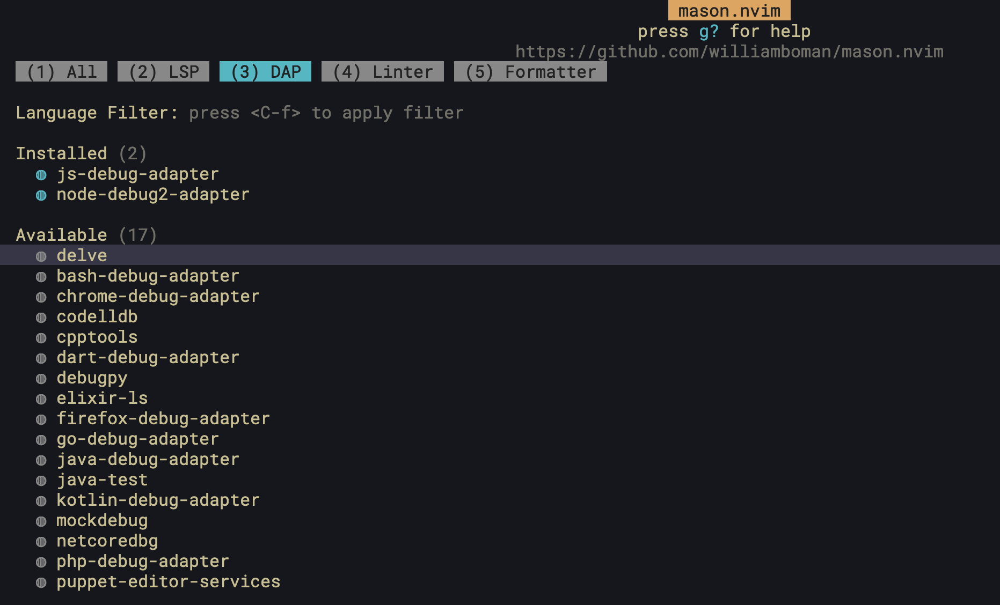
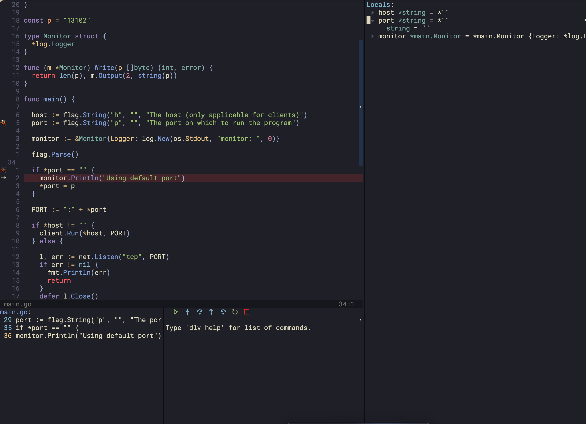

You'll probably spend more time debugging your next application than physically typing out the code required to run it. For a little while, the premier tool in the software industry for text manipulation, Neovim, was woefully behind IDEs like VSCode in it's debugger implementation. That's no longer the case. 

The <a href="https://microsoft.github.io/debug-adapter-protocol/specification">Debug Adapter Protocol (DAP)</a> lets Neovim serve as a fully-featured debugger client, letting you attach to a running instance of your code, set breakpoints, inspect variables, examine call stacks, among other helpful debugging techniques.

This post is meant to serve as a basic guide for setting up a debugger in Neovim. Although it applies specifically to Golang, the principles are the same for debuggers for other languages, so long as they implement the Debug Adapter Protocol.

## What is DAP?

The Debug Adapter Protocol, or DAP, is a set of rules for how a debugger communicates with a client (usually an editor). Microsoft's <a href="https://microsoft.github.io/debug-adapter-protocol/">summary</a> puts it succinctly:

<p style="margin-left: 30px;">"The idea behind the Debug Adapter Protocol (DAP) is to abstract the way how the debugging support of development tools communicates with debuggers or runtimes into a protocol .. The Debug Adapter Protocol makes it possible to implement a generic debugger for a development tool that can communicate with different debuggers via Debug Adapters. And Debug Adapters can be re-used across multiple development tools which significantly reduces the effort to support a new debugger in different tools."</p>

Translating this to a specific language like Golang, we need the following pieces:

1. Our editor (Neovim)
2. The DAP "client" (the `nvim-dap` plugin)
3. The debugger-specific implementations, which we will write
3. The debugger (`delve`)
4. The program to run (go code)

## Installing the Debugger

In order to debug a program you need a debugger. This is the tool, typically but not always a binary executable, that runs completely outside of Neovim and attaches to the running process you are trying to debug. To debug the application, I'm going to use the <a href="https://github.com/go-delve/delve">Delve</a> debugger. 

The program that I'm going to "debug" is a simple TCP server implemented in Golang. You can get the same source code <a href="https://github.com/harrisoncramer/go-connect-tcp.git">here</a> or you can use your own program.

You can compile and run the TCP server by navigating to the root directory, and running: 

```bash
$ go run main.go
```

The equivalent command with Delve, which compiles the program with the correct debugger flags, and then starts that binary and attaches, is the following:

```bash
$ dlv debug main.go
```

With delve attached, you can then step through the code in a REPL-like environment. 

You can install the Delve and other debuggers outside of Neovim, but I prefer to keep my debugger installations baked into my Neovim configuration with <a href="https://github.com/williamboman/mason.nvim">Mason</a>, and optionally, <a href="https://github.com/jay-babu/mason-nvim-dap.nvim">mason-nvim-dap</a>. This lets me automatically install them in a consistent path, even if my machine changes. Mason is the defacto Neovim standard for debugger installations, LSP installations, linters, and formatters.

After adding Mason to your Neovim configuration (I'm using Packer to manage my plugins), open up Mason's UI with the `:Mason` command, and navigate to the DAP page:



Install the delve debugger by pressing the `i` key to install it. Once the debugger is installed, you should be able to see the binary in Mason's standard binary path at `~/.local/share/nvim/mason/bin`. In a terminal window, run the following command to prove it's been installed:

```bash
$  ~/.local/share/nvim/mason/bin/dlv version
Delve Debugger
Version: 1.20.1
Build: $Id: 96e65b6c615845d42e0e31d903f6475b0e4ece6e
```

Great! We know now that `delve` is installed on our machine at the specified path.

> This next part is optional. Skip it if you'd like.

This is all fine and good, but we can actually use another plugin _for mason_ to specify the debuggers we want installed automatically, called <a href="https://github.com/jay-babu/mason-nvim-dap.nvim">mason-nvim-dap</a>. Install this and add the following line to your Neovim configuration file:

```lua
require("mason-nvim-dap").setup({
    ensure_installed = { "delve" }
})
```

Next, uninstall the delve debugger through Mason's UI (the same way you installed it, but by pressing `X` when hovering over it). Close and reopen Neovim, and you should see that the debugger is automatically installed for you in the same path. Check the messages with `:messages` and you should see the following:

```
[mason-nvim-dap] installing delve
[mason-nvim-dap] delve was installed
```

This is great, because it allows us to specify the automatic installation of debuggers directly within our Neovim configuration. Not all debuggers available by Mason are included in this extra extension, so just be aware of that.

## Installing Nvim-DAP

Next, we need to install <a href="https://github.com/mfussenegger/nvim-dap">nvim-dap</a>, the plugin that will actually allow Neovim to communicate with Delve.

Once you have it installed, let's see nvim-dap "breaking" before we understand how to get it working. Install nvim-dap, and open up the `main.go` file in your project and run the following ex command: `:lua require("dap").continue()`

You should see the following message:

```
No configuration found for `go`. You need to add configs to `dap.configurations.go` (See `:h dap-configuration`)
```

What's going on here? We've installed the debugger, and the debugger adapter for Neovim, but we haven't told nvim-dap what do to for Golang files yet. As the documentation states: "Neovim needs to instruct the debug adapter .. how to launch and connect to the debugee. The debugee is the application you want to debug."

Add the following to your configuration:

```lua
local dap_ok, dap = pcall(require, "dap")
if not (dap_ok) then
  print("nvim-dap not installed!")
  return
end

require('dap').set_log_level('INFO') -- Helps when configuring DAP, see logs with :DapShowLog

dap.configurations = {
    go = {
      {
        type = "go", -- Which adapter to use
        name = "Debug", -- Human readable name
        request = "launch", -- Whether to "launch" or "attach" to program
        program = "${file}", -- The buffer you are focused on when running nvim-dap
      },
    }
}
```

Now, run the same command. You should see a different error message:

```
The selected configuration references adapter `go`, but dap.adapters.go is undefined
```

We now need to specify a debug adapter that will run for this configuration. Add this to your configuration:

```lua
dap.adapters.go = {
  type = "server",
  port = "${port}",
  executable = {
    command = vim.fn.stdpath("data") .. '/mason/bin/dlv',
    args = { "dap", "-l", "127.0.0.1:${port}" },
  },
}
```

We should finally be set up and ready to run the debugger for real. Hover over a line in the `main.go` file and set a breakpoint with `:lua require("dap").toggle_breakpoint()` then re-run the above command to start the debugger.

After a moment, you should see the debugger pause on the line you set. You shouldn't see any errors, and if you grep for a running delve process, you should see it:

```
$ top | grep dlv
96326  dlv              0.0  00:00.09 16     0   37     17M    0B    0B    96326 96166 sleeping *0[1]      0.00000 0.00000    501 2160     443   40        15        6086       112       2575       0       11       0.0   0         0         harrisoncramer         N/A    N/A   N/A   N/A   N/A   N/A
96326  dlv              0.0  00:00.09 16     0   37     17M    0B    0B    96326 96166 sleeping *0[1]      0.00000 0.00000    501 2160     443   40        15        6086       112       2575       0       11       0.0   0         0         harrisoncramer         N/A    N/A   N/A   N/A   N/A   N/A
96326  dlv              0.0  00:00.09 16     0   37     17M    0B    0B    96326 96166 sleeping *0[1]      0.00000 0.00000    501 2160     443   40        15        6086       112       2575       0       11       0.0   0         0         harrisoncramer         N/A    N/A   N/A   N/A   N/A   N/A
96326  dlv              0.0  00:00.09 16     0   37     17M    0B    0B    96326 96166 sleeping *0[1]      0.00000 0.00000    501 2160     443   40        15        6102+      112       2585+      0       12+      0.0   146088    455607    harrisoncramer         N/A    N/A   N/A   N/A   N/A   N/A
96326  dlv              0.0  00:00.09 16     0   37     17M    0B    0B    96326 96166 sleeping *0[1]      0.00000 0.00000    501 2160     443   40        15        6102       112       2585       0       12       0.0   0         0         harrisoncramer         N/A    N/A   N/A   N/A   N/A   N/A
```

Nice! This shows that we've successfully set up delve to launch via Neovim. This is the first step! Finally, close and terminate the debugger with `:lua require("dap").terminate()` which will close the delve process and terminate the connection.

## Configuring Dap-UI

The default experience with DAP is pretty rough without a better interface, and keybindings to start and stop the debugger, set breakpoints in the code, and so forth. Luckily, this is very easy to configure with <a href=" https://github.com/rcarriga/nvim-dap-ui">nvim-dap-ui</a>. This is the configuration that I like.

```lua
local dap_ui_ok, ui = pcall(require, "dapui")
if not (dap_ok and dap_ui_ok) then
  require("notify")("dap-ui not installed!", "warning")
  return
end

ui.setup({
  icons = { expanded = "▾", collapsed = "▸" },
  mappings = {
    open = "o",
    remove = "d",
    edit = "e",
    repl = "r",
    toggle = "t",
  },
  expand_lines = vim.fn.has("nvim-0.7"),
  layouts = {
    {
      elements = {
        "scopes",
      },
      size = 0.3,
      position = "right"
    },
    {
      elements = {
        "repl",
        "breakpoints"
      },
      size = 0.3,
      position = "bottom",
    },
  },
  floating = {
    max_height = nil,
    max_width = nil,
    border = "single",
    mappings = {
      close = { "q", "<Esc>" },
    },
  },
  windows = { indent = 1 },
  render = {
    max_type_length = nil,
  },
})
```

I also have the following keybindings set up to call functions in both plugins:

```lua
local dap_ok, dap = pcall(require, "dap")
local dap_ui_ok, ui = pcall(require, "dapui")

if not (dap_ok and dap_ui_ok) then
  require("notify")("nvim-dap or dap-ui not installed!", "warning") -- nvim-notify is a separate plugin, I recommend it too!
  return
end

vim.fn.sign_define('DapBreakpoint', { text = '🐞' })

-- Start debugging session
vim.keymap.set("n", "<localleader>ds", function()
  dap.continue()
  ui.toggle({})
  vim.api.nvim_feedkeys(vim.api.nvim_replace_termcodes("<C-w>=", false, true, true), "n", false) -- Spaces buffers evenly
end)

-- Set breakpoints, get variable values, step into/out of functions, etc.
vim.keymap.set("n", "<localleader>dl", require("dap.ui.widgets").hover)
vim.keymap.set("n", "<localleader>dc", dap.continue)
vim.keymap.set("n", "<localleader>db", dap.toggle_breakpoint)
vim.keymap.set("n", "<localleader>dn", dap.step_over)
vim.keymap.set("n", "<localleader>di", dap.step_into)
vim.keymap.set("n", "<localleader>do", dap.step_out)
vim.keymap.set("n", "<localleader>dC", function()
  dap.clear_breakpoints()
  require("notify")("Breakpoints cleared", "warn")
end)

-- Close debugger and clear breakpoints
vim.keymap.set("n", "<localleader>de", function()
  dap.clear_breakpoints()
  ui.toggle({})
  dap.terminate()
  vim.api.nvim_feedkeys(vim.api.nvim_replace_termcodes("<C-w>=", false, true, true), "n", false)
  require("notify")("Debugger session ended", "warn")
end)
```


We now have a nice interface that lets us step through the code, view breakpoints, and so forth. Here's what the full setup looks like on my machine:



## Multiple Configurations

This works fine if you want to run the equivalent of `dlv debug .` locally. But what if you want to have multiple different debug configurations for different scenarios? You can simply add another table to your `dap.configurations.go` table! I've got separate configurations for:

1. Compiling and running the program with delve right away (what we just configured)
2. Debugging a test file
3. Attaching to a running debugger by picking it's PID
4. Attaching to an already running debugger running on a specific port

They look like this, and nvim-dap will ask me which of the configurations I'd like to use when I open it on a Golang file:

```lua
local go = {
  {
    type = "go",
    name = "Debug",
    request = "launch",
    program = "${file}",
  },
  {
    type = "go",
    name = "Debug test (go.mod)",
    request = "launch",
    mode = "test",
    program = "./${relativeFileDirname}",
  },
  {
    type = "go",
    name = "Attach (Pick Process)",
    mode = "local",
    request = "attach",
    processId = require('dap.utils').pick_process,
  },
  {
    type = "go",
    name = "Attach (127.0.0.1:9080)",
    mode = "remote",
    request = "attach",
    port = "9080"
  },
}
```

## Repeating this for NodeJS

This pattern lets us easily set up debuggers for a variety of different languages and tools. For instance, let's set up a debugger for Node (server-side Javascript) now.

First, let's add the debugger to our list of required debuggers (if you skipped this step earlier you can just install it manually with Mason):

```lua{2}
require("mason-nvim-dap").setup({
    ensure_installed = { "delve", "node2" }
})
```

Next we just need to add a configuration for JS files to our `dap.configurations` table:

```lua{10-31}
dap.configurations = {
    go = {
      {
        type = "go", -- Which adapter to use
        name = "Debug", -- Human readable name
        request = "launch", -- Whether to "launch" or "attach" to program
        program = "${file}", -- The buffer you are focused on when running nvim-dap
      },
    },
    javascript = {
      {
        type = 'node2';
        name = 'Launch',
        request = 'launch';
        program = '${file}';
        cwd = vim.fn.getcwd();
        sourceMaps = true;
        protocol = 'inspector';
        console = 'integratedTerminal';
      },
      {
        type = 'node2';
        name = 'Attach',
        request = 'attach';
        program = '${file}';
        cwd = vim.fn.getcwd();
        sourceMaps = true;
        protocol = 'inspector';
        console = 'integratedTerminal';
      },
    }
}
```

And finally an entry to our `dap.adapters` table for the debugger that we just installed:

```lua
dap.adapters.node2 = {
  type = 'executable';
  command = 'node',
  args = { vim.fn.stdpath("data") .. '/mason/packages/node-debug2-adapter/out/src/nodeDebug.js' };
}
```

Now we can open up Javascript files and set breakpoints and inspect code the same way we did with Go! You can see now why DAP is a powerful framework that lets us easily abstract away langugage-specific debugger implementations!

## Next Steps

We've now walked through the installation of the debugger, the debugger adapter, configuring the debugger, and adding a UI layer. If something goes wrong during your own setup, check Neovim's messages, and also DAP's logs with `:DapShowLog`.

It's worth mentioning that you can achieve configuration of the debug adapter for Go specifically with <a href="https://github.com/leoluz/nvim-dap-go">nvim-dap-go</a>, which will effectively write the `dap.configurations.go` and `dap.adapters.go` sections of your DAP configuration for you. You'll still need to install the debugger (delve) in order to use it, and the UI. If you prefer a more out-of-the-box configuration for Golang specifically, this plugin is quite nice.

Finally, you can find my personal dotfiles <a href="github.com/harrisoncramer/nvim">here</a> and specifically my debugger configuration <a href="https://github.com/harrisoncramer/nvim/tree/main/lua/plugins/dap">here</a>.


