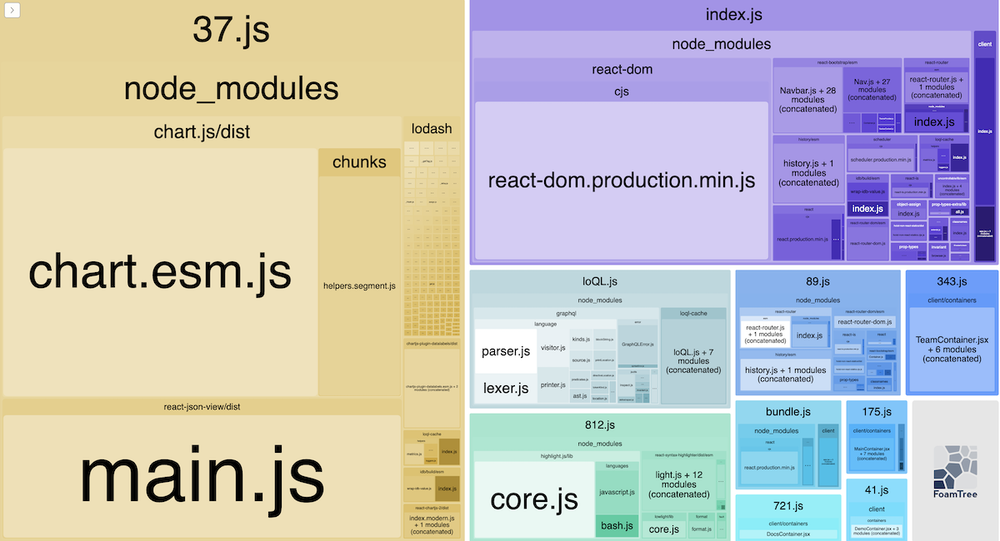

Myself and some other engineers were in the process of deploying <a href="https://loql.land">loql.land</a> to a production environment last weekend, and I noticed that we had forgotten to optimize the webpack build. The lighthouse scores were horrific: We were shipping 9MB to clients, and our lighthouse performance score was abysmal. After a few hours of work (most of which was just research) we were able to cut our bundle size down to less than 100KB. 

Here are some of the steps we took, and which you can apply to your own projects to slim down your final build. This tutorial is written for Webpack v5, and assumes you have a simple working repository that you would like to optimize. If you'd rather start with the same boilerplate as me, you can download it <a href="https://s3.amazonaws.com/harrisoncramer.me.assets/loql.tar.gz">here</a>.

<p class="tip">If you're unfamiliar with tar files, <a class="dark__link" href="https://linuxize.com/post/how-to-extract-unzip-tar-gz-file/">this</a> guide will help you expand the repository!</p>

## Split up your webpack files

The first thing that you'll notice about this repository is that we have multiple webpack configuration files, instead of just one. Our production file contains all of the optimizations that we're going to use when we are running a production build, and the development configuration file contains all of the configuration we need to do only in development, such as running the development server with hot reloading.

To merge these files together, we're going to rely on `webpack-merge` which is an open-source plugin. First, let's take a look at our common webpack file. The file is split up here for readability.

```javascript:title=webpack.common.js
const path = require('path');
const webpack = require('webpack');
const HtmlWebpackPlugin = require('html-webpack-plugin');
const Dotenv = require('dotenv-webpack');

module.exports = {
  entry: {
    index: './client/index.js',
    bundle: './client/app.jsx',
    loQL: './node_modules/loql-cache/loQL.js',
  },
  output: {
    path: path.resolve(__dirname, '..', 'build'),
    filename: '[name].js',
    clean: true,
  },
  
  ...
```

We're setting our entry files and output files. The `[name]` syntax will let webpack split our bundle up into chunks, rather than stuff all of our code into a single bundle file. Let's continue.

```javascript:title=webpack.common.js
  ...

  module: {
    rules: [
      {
        test: /.(js|jsx)$/,
        exclude: /node_modules/,
        loader: 'babel-loader',
        options: {
          presets: ['@babel/preset-react'],
        },
      },
      {
        test: /\.(png|jpg|jpeg|ico|mp4)$/i,
        use: [
          {
            loader: 'url-loader',
            options: {
              limit: 8192,
            },
          },
        ],
      },
    ],
  }
  
  ...
```

Here, we're running all of our javascript files through babel in order to compile them down to vanilla javascript. We're also sending our static files—images, videos, and so forth—through the url-loader, which creates URLs that we can use in our code.

```javascript:title=webpack.common.js
  ...
  
  plugins: [
    new Dotenv({
      path: path.resolve(__dirname, `../.${process.env.NODE_ENV}.env`),
    }),
    new HtmlWebpackPlugin({
      template: './client/index.html',
      favicon: './client/assets/favicon.ico',
    }),
  ],
  resolve: {
    extensions: ['.js', '.jsx'],
  },
};
```

Finally, we're using a few plugins here. One will grab environment variables from our environment files. Those files are going to be named according to the environment that we're in, either as `.development.env` or `.production.env`, respectively. Lastly, we're using another plugin to dynamically create our HTML file. Let's take a look at our production file now.


```javascript:title=webpack.prod.js
const { merge } = require('webpack-merge');
const TerserPlugin = require('terser-webpack-plugin');
const MiniCssExtractPlugin = require('mini-css-extract-plugin');
const CssMinimizerPlugin = require('css-minimizer-webpack-plugin');

const common = require('./webpack.common.js');
module.exports = merge(common, {
  mode: 'production',
  module: {
    rules: [
      {
        test: /\.css$/i,
        use: [MiniCssExtractPlugin.loader, 'css-loader'],
      },
      {
        test: /\.s[ac]ss$/i,
        exclude: /node_modules/,
        use: [MiniCssExtractPlugin.loader, 'css-loader', 'sass-loader'],
      },
    ],
  },
  plugins: [new MiniCssExtractPlugin()],
  optimization: {
    minimize: true,
    minimizer: ['...', new CssMinimizerPlugin()],
  },
  resolve: {
    extensions: ['.js', '.jsx'],
  },
});
```

This file is shorter because it's additive—we are going to run these optimizations when we are building a production version of our site. To accomplish this, we are calling the `merge` function and exporting the result. In order to pick up this configuration, we point the webpack CLI at the production file using the `--config` flag.

```json{10}:title=package.json
{
  "name": "loql.land",
  "version": "1.0.0",
  "description": "",
  "main": "index.js",
  "scripts": {
    "start": "concurrently \"npm run dev:webpack\" \"npm run dev:express\"",
    "dev:webpack": "NODE_ENV=development webpack serve --config ./webpack/webpack.dev.js",
    "dev:express": "NODE_ENV=development PORT=3000 nodemon server/index.js",
    "prod:webpack": "NODE_ENV=production webpack --config ./webpack/webpack.prod.js",
    "prod:express": "NODE_ENV=production PORT=3000 node server/index.js",
    "prod:analyze": "NODE_ENV=production ANALYZE=true webpack --config ./webpack/webpack.prod.js"
  }

  ...

```

Great, now that we actually understand how these files are getting merged and run, what are the actual optimizations that are in place?

## Use production mode

This one may seem obvious, but it's easy to miss. Make sure that you are using production mode in your `webpack.config` file. This is going to enable a number of default settings, including the <a href="https://webpack.js.org/plugins/terser-webpack-plugin/">Terser</a> plugin, which helps minify and uglify your code.

```javascript{8}:title=webpack.prod.js
const { merge } = require('webpack-merge');
const TerserPlugin = require('terser-webpack-plugin');
const MiniCssExtractPlugin = require('mini-css-extract-plugin');
const CssMinimizerPlugin = require('css-minimizer-webpack-plugin');

const common = require('./webpack.common.js');
module.exports = merge(common, {
  mode: 'production',
  module: {
    rules: [
      {
        test: /\.css$/i,
        use: [MiniCssExtractPlugin.loader, 'css-loader'],
      },
      {
        test: /\.s[ac]ss$/i,
        exclude: /node_modules/,
        use: [MiniCssExtractPlugin.loader, 'css-loader', 'sass-loader'],
      },
    ],
  },
  plugins: [new MiniCssExtractPlugin()],
  optimization: {
    minimize: true,
    minimizer: ['...', new CssMinimizerPlugin()],
  },
  resolve: {
    extensions: ['.js', '.jsx'],
  },
});
```

Behind the scenes, webpack uses the <a href="https://webpack.js.org/plugins/terser-webpack-plugin/">Terser</a> plugin to do this. In previous versions of webpack, you had to manually configure this functionality yourself. It's now provided by default!

## Remove source maps

This is another one that's easy to miss. Source maps are <a href="https://developer.mozilla.org/en-US/docs/Tools/Debugger/How_to/Use_a_source_map">a valuable debugging tool</a> when running in development. We're using them in our development configuration.

```javascript{5}:title=webpack.dev.js
import { merge } from 'webpack-merge';
import common from './webpack.common.js';

export default merge(common, {
  devtool: 'eval-source-map',
  mode: 'development',
  module: {
    rules: [
      {
        test: /\.s[ac]ss$/i,
        exclude: /node_modules/,
        use: ['style-loader', 'css-loader', 'sass-loader'],
      },
      {
        test: /\.css$/i,
        use: ['style-loader', 'css-loader'],
      },
    ],
  }

  ...

```

However, these source maps are extraordinarily heavy. You'll notice a major performance hit if you forget to take them out in production. For this particular site, our compiled code is roughly three times larger with the development source maps included!

## Minify and Uglify your CSS/JS

When you set the production mode, webpack will automatically minify and uglify your Javascript. Minification refers to the practice of shrinking down your files—by removing white space, removing line breaks, and so forth. Uglification refers to the practice of actually *renaming* functions, variables, and other code (typically, to very short values). These two features combined can shrink our code significantly.

We _also_ want to minify and uglify our stylesheets. To do this, we installed <a href="https://webpack.js.org/plugins/mini-css-extract-plugin/">one plugin</a> to pull our CSS out of our Javascript bundle, and <a href="https://webpack.js.org/plugins/css-minimizer-webpack-plugin/">another</a> to actually minify and uglify the code.

<p class="tip">When it compiles your code, webpack will normally pack all of your styles alongside your Javascript code. The css is then dynamically run and applied when your code is shipped to the browser. That's why you <em>could</em> have just one output file, like a <code>bundle.js</code> file, which would contain all the code needed to run your application. In our case, we want to pull the CSS out of that bundle so that we can minify and uglify it.</p>

```javascript{14,19,24,29}:title=webpack.prod.js
const { merge, unique } = require('webpack-merge');
const TerserPlugin = require('terser-webpack-plugin');
const MiniCssExtractPlugin = require('mini-css-extract-plugin');
const CssMinimizerPlugin = require('css-minimizer-webpack-plugin');
const { BundleAnalyzerPlugin } = require('webpack-bundle-analyzer');

const common = require('./webpack.common.js');
module.exports = merge(common, {
  mode: 'production',
  module: {
    rules: [
      {
        test: /\.css$/i,
        use: [MiniCssExtractPlugin.loader, 'css-loader'],
      },
      {
        test: /\.s[ac]ss$/i,
        exclude: /node_modules/,
        use: [MiniCssExtractPlugin.loader, 'css-loader', 'sass-loader'],
      },
    ],
  },
  plugins: [
    new MiniCssExtractPlugin(),
    ...(process.env.ANALYZE ? [new BundleAnalyzerPlugin()] : []),
  ],
  optimization: {
    minimize: true,
    minimizer: ['...', new CssMinimizerPlugin()],
  },
  resolve: {
    extensions: ['.js', '.jsx'],
  },
});
```

This optimization is particularly useful if you're relying on an external library like Bootstrap that ships with a lot of CSS. Speaking of which...

## Analyze your bundle and & remove large packages

If the only optimizations you're running are in your webpack files, you're doing something wrong. You should *also* check to make sure that none of the dependencies of your project are extremely large or bloated.

The easiest way to do this is to install the <a href="https://www.npmjs.com/package/webpack-bundle-analyzer">webpack bundle analyzer</a>, which shows you the overall size of your bundle. We've set up a separate script to use our bundle analyzer with our production configuration file. To do this, we're passing an environment variable.

```json{12}:title=package.json
{
  "name": "loql.land",
  "version": "1.0.0",
  "description": "",
  "main": "index.js",
  "scripts": {
    "start": "concurrently \"npm run dev:webpack\" \"npm run dev:express\"",
    "dev:webpack": "NODE_ENV=development webpack serve --config ./webpack/webpack.dev.js",
    "dev:express": "NODE_ENV=development PORT=3000 nodemon server/index.js",
    "prod:webpack": "NODE_ENV=production webpack --config ./webpack/webpack.prod.js",
    "prod:express": "NODE_ENV=production PORT=3000 node server/index.js",
    "prod:analyze": "NODE_ENV=production ANALYZE=true webpack --config ./webpack/webpack.prod.js"
  },
  "repository": {
    "type": "git",

...

```

This variable is picked up inside of our configuration file and is used to add the plugin. This expression will expand the value in the array (in this case, just the plugin) if the `ANALYZER` variable is true, otherwise it'll expand an empty array and won't add anything to the plugins array.


```javascript{3}:title=webpack.prod.js
  plugins: [
    new MiniCssExtractPlugin(),
    ...(process.env.ANALYZE ? [new BundleAnalyzerPlugin()] : []),
  ],
});

```

The analyzer plugin will startup a server on `localhost:8888` that will show a nice visualization of our bundled code. Here's what it looks like.



The biggest dependencies for this particular project are bootstrap and ChartJS, particularly the latter. How can we slim these down?

One of the most important things to check is your import statements. Make sure that you're not importing the entire package and then destructuring different functions and properties off of the entire object. Instead, only import the values that you need. For instance, try to avoid imports like this whenever possible.

```javascript
import * as myObject from "my-dependency";
```

Instead, only import the stuff you need.


```javascript
import myObject from "my-dependency/lib/myObject";
```

This can dramatically reduce your bundle size, especially with big libraries like Bootstrap. Notice in our project, for instance, that we're importing all of our bootstrap components like this. For instance, with the footer.


```javascript{3-5}:title=Footer.js
import React from 'react';
import { Link } from 'react-router-dom';
import Container from 'react-bootstrap/Container';
import Navbar from 'react-bootstrap/Navbar';
import Nav from 'react-bootstrap/Nav';
import './Footer.scss';

const Footer = () => {

...
```

If this isn't possible, really think hard about what dependencies you need. In our case, I'm considering swapping out ChartJS for D3 because of how heavy the former is. We're only using it to render a few bar charts, is it really worth that extra bloat in our codebase? Probably not.

## Use lazy loading

This is another step that will require to you refactor your code slighly, but it's worth it. 

The idea of "lazy" loading code is to only make users load code for the components they are currently using. Webpack accomplishes this by splitting your code into "chunks" and then only loading the chunks needed to render a particular page.

In this project, we're lazy loading our code according to specific routes in our router. Let's take a look at our `app.jsx` file, which contains our routing.

```javascript{11-14,5}:title=app.jsx
import '@fontsource/roboto';
import '@fontsource/poppins';
import '@fontsource/ibm-plex-sans';

import React, { lazy, Suspense } from 'react';
import { BrowserRouter as Router, Route, Switch } from 'react-router-dom';
import NavBar from './components/Navbar';
import Footer from './components/Footer';
import Loading from './components/Loading';

const DemoContainer = lazy(() => import('./containers/DemoContainer'));
const MainContainer = lazy(() => import('./containers/MainContainer'));
const TeamContainer = lazy(() => import('./containers/TeamContainer'));
const DocsContainer = lazy(() => import('./containers/DocsContainer'));

...

```

To make the `lazy` function work, we also need to wrap the routes in the `Suspense` component, also supplied by React, and provide a fallback to render when the fetch is occuring. In our case, we're going to render a loading component.

```jsx:title=app.jsx
...

const App = () => {
  return (
    <Router>
      <NavBar />
      <div className="content-wrapper">
        <Switch>
          <Suspense fallback={<Loading />}>
            <Route path="/demo">
              <DemoContainer />
            </Route>
            <Route path="/docs">
              <DocsContainer />
            </Route>
            <Route path="/team">
              <TeamContainer />
            </Route>
            <Route exact path="/">
              <MainContainer />
            </Route>
          </Suspense>
        </Switch>
      </div>
      <Footer className="footer" />
    </Router>
  );
};

export default App;
```

The `lazy` function that we're importing from React returns a promise. Intead of directly importing our various views and then adding those to our router, we're using the lazy function to only import them when the user navigates to the relevant page in our router.


Weback is smart enough to see this code and split our code into chunks, which will be loaded piecemeal when the user navigates around our site. They won't have to download code they aren't going to use, and the overall experience of the application is going to be better.

## Optimize your media

Across the board, make sure that you're optimizing the media you serve to your clients. If you've got images, make sure they are not gigantic in width and height, and also make sure that you run them through <a href="https://tinypng.com/">tinypng</a> or another comparable image compressor to reduce their size.

You also should really avoid using GIFs, which can be absolutely massive in size. Instead, convert the GIFs to MP4 files (I use an awesome free tool called <a href="https://formulae.brew.sh/formula/ffmpeg">ffmpeg</a> that is quick and easy) which are much smaller. You can then autoplay those videos.

```jsx{26-28}:title=MainContainer.jsx
import React, { Component, useState, useEffect } from 'react';
import { Link } from 'react-router-dom';
import Container from 'react-bootstrap/Container';
import rider from '../assets/rider.mp4';

import Row from 'react-bootstrap/Row';
import Col from 'react-bootstrap/Col';
import Card from 'react-bootstrap/Card';

import './Main.scss';

const SplashPage = () => {
  return (
    <div className="main-content">
      <Container>
        <article className="main">
          <div className="splash">
            <div id="main-left">
              <div className="bigTitle">Fast, offline GraphQL caching</div>
              <div className="bigDescription">
                loQL is a lightweight, open source npm package that caches API requests with service
                workers, unlocking performance gains and enabling offline use.
              </div>
            </div>
            <div id="main-right">
              <video autoPlay loop muted playsInline className="bike-animation">
                <source src={rider} type="video/mp4" />
              </video>
            </div>
          </div>
          
          ...
```

For more detail on this process, this <a href="https://web.dev/replace-gifs-with-videos/">post</a> is very helpful.

## Serve your files with compression

This step is not necessarily going to happen inside of webpack, but it's worth mentioning. Make sure that however you're serving up your content, you're using some sort of compression, like gzip for instance. 

Modern browsers will ask for a compressed version of every file by default first, and know how to decompress it themeselves. Turning on compression is therefore an easy win that you can set up with a few lines of code.

Our React application is sitting behind Nginx. Here's part of our reverse proxy configuration.

```nginx{25-32}:title=nginx.conf
user www-data;
worker_processes auto;
pid /run/nginx.pid;
include /etc/nginx/modules-enabled/*.conf;

events {
  worker_connections 768;
}

http {
  sendfile on;
  tcp_nopush on;
  tcp_nodelay on;
  keepalive_timeout 65;
  types_hash_max_size 2048;
  include /etc/nginx/mime.types;
  default_type application/octet-stream;

  ssl_protocols TLSv1 TLSv1.1 TLSv1.2;
  ssl_prefer_server_ciphers on;

  access_log /var/log/nginx/access.log;
  error_log /var/log/nginx/error.log;
  
  gzip on;

  gzip_vary on;
  gzip_proxied any;
  gzip_comp_level 6;
  gzip_buffers 16 8k;
  gzip_http_version 1.1;
  gzip_types text/plain text/css application/json application/javascript text/xml application/xml application/xml+rss text/javascript;

  include /etc/nginx/conf.d/*.conf;
  include /etc/nginx/sites-enabled/*;
}
```

This tutorial isn't going to go into the details of what a reverse proxy is and why that's used with NodeJS, but suffice to say that however you're serving up your content—whether through Apache, Nginx, or any other webserver—you should be using compression.
