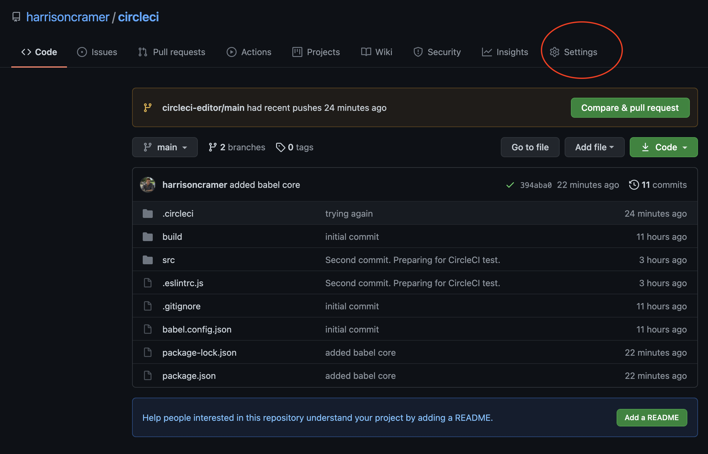
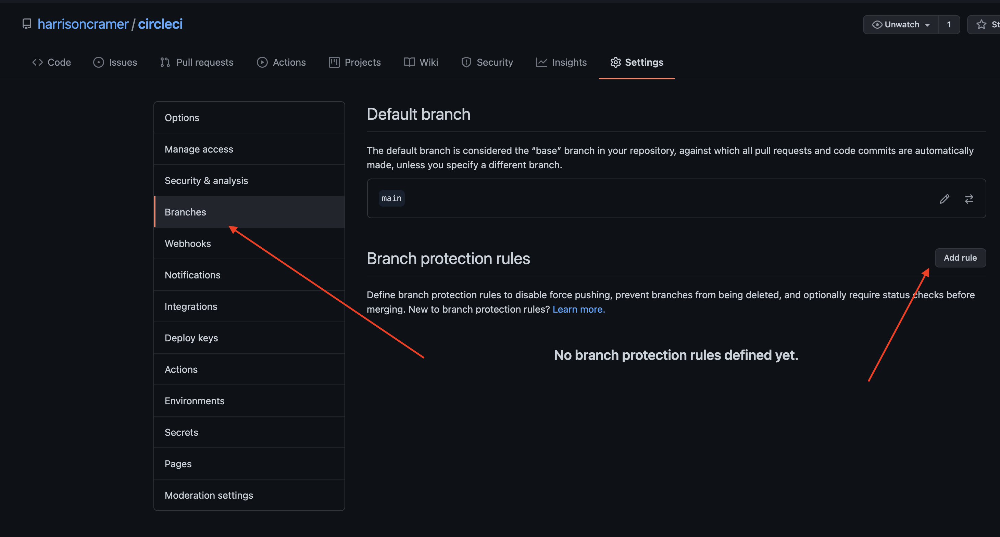
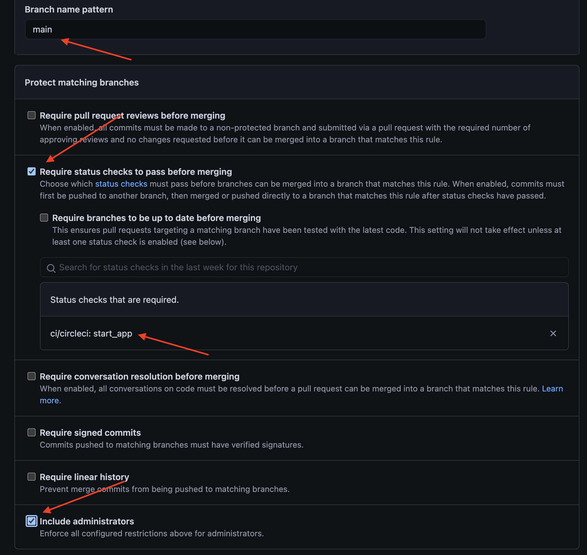
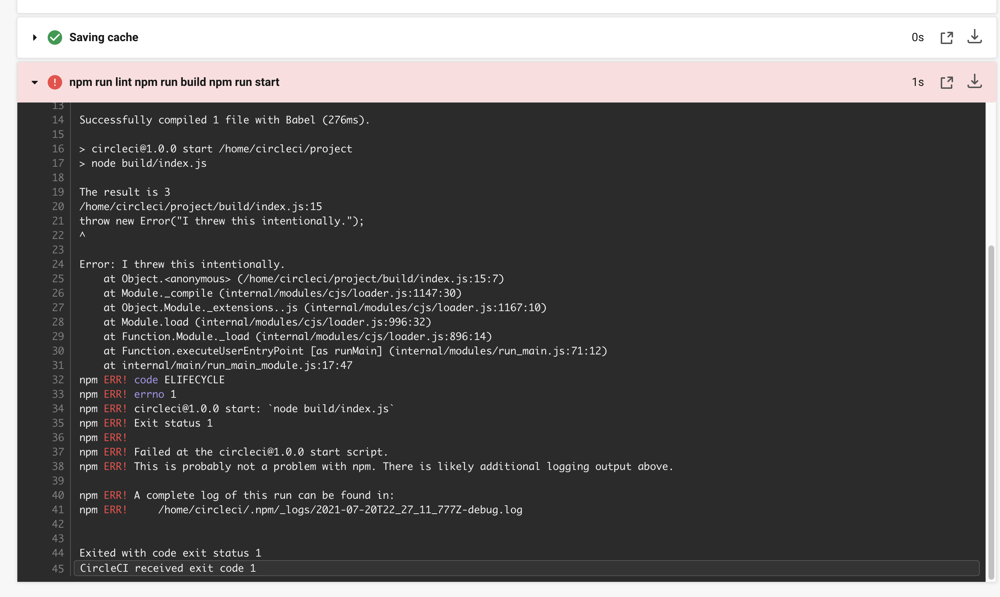
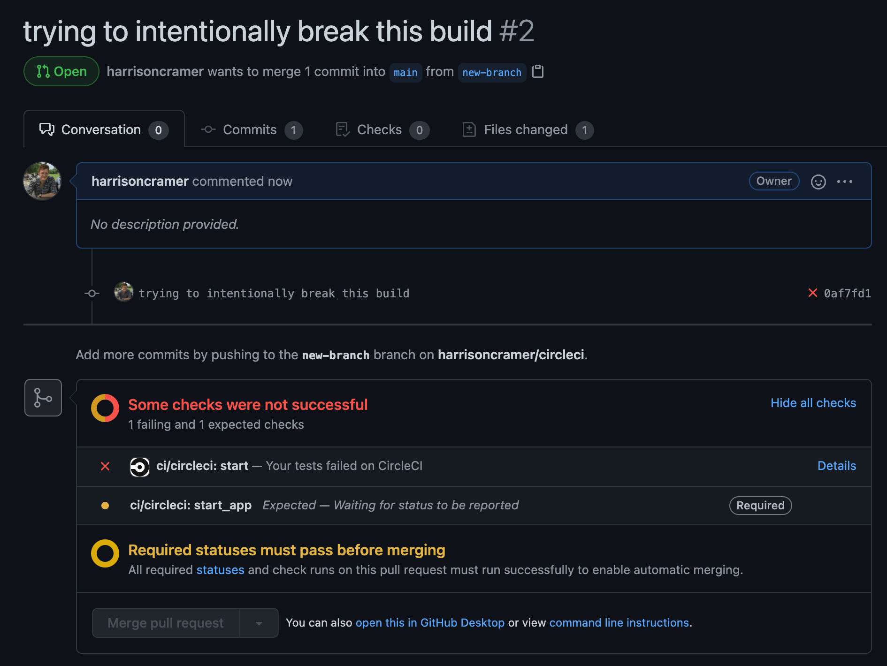

When working in a team, it can be difficult to ensure that everyone is linting and testing their code before making pull requests on the main branch. Don't you wish there was an easy way to ensure that other developers can't merge into your main branch until they pass a set of tests? There is!

## What are we making?

We're going to set up a simple *continuous integration* rool for a Github project, that will automatically run tests whenever anyone pushes their code up to a feature branch. That way, we'll ensure that branches cannot be merged into the main (or production) branch unless they pass certain tests. This will ensure that our main branch stays in an always deployable state. It'll also keep our code clean and seriously reduce the amount of bugs in our production codebase.

## Setting up the project

The files that we're going to build, test, and lint will be very simple. We're mainly going to be writing a configuration file for CircleCI, which is the continuous integration tool we'll be using. Let's create our Javascript project and initialize the Githube repository.

<p class="tip">I'm using the Github CLI for this tutorial. I'd recommend installing it, it makes the process of repository management very easy if you like working in the text.</p>

```text
$ mkdir joke && cd joke
$ npm init -y
$ git init
$ gh repo create
```

We're going to use ESLint as our linter, and we're going to compile our project with Babel. Let's install those dependencies now.

```text
$ npm install -D @babel/cli @babel/node @babel/preset-env
$ npm install -D eslint
```

And let's set up our eslint file. We're not going to use React or Typescript, for the purposes of this tutorial it'll be very simple.

```json:title=.eslintrc.js
module.exports = {
  env: {
    es2021: true,
    node: true,
  },
  extends: "eslint:recommended",
  parserOptions: {
    ecmaVersion: 12,
    sourceType: "module",
  },
  rules: {},
};
```

Next, let's add a build script, a lint script, and a start script.

```json{7-9}:title=package.json
{
  "name": "circleci",
  "version": "1.0.0",
  "description": "",
  "main": "index.js",
  "scripts": {
    "build": "babel src -d build",
    "lint": "eslint src/**.js",
    "start": "node build/index.js",
    "test": "echo \"Error: no test specified\" && exit 1"
  },
  "keywords": [],
  "author": "Harrison Cramer <kingofcramers.dev@gmail.com> (https://github.com/kingofcramers)",
  "license": "MIT",
  "devDependencies": {
    "@babel/cli": "^7.14.5",
    "@babel/node": "^7.14.7",
    "@babel/preset-env": "^7.14.7",
    "eslint": "^7.31.0"
  }
}
```

As you can see, Babel expects to find our source files in a directory called `src`. Let's create that now and add the simplest Javascript file imaginable, but written using ESM, so that it'll be compiled.

```javascript:title=src/index.js
export const add = (a, b) => {
  const result = a + b;
  console.log(`The result is ${result}`);
};
```

We'll now create our configuration file for Babel, so that the compiler will translate our ESM back into CommonJS modules; This way our script can be run with vanilla NodeJS.

```json:title=babel.config.json
{
  "presets": [
    [
      "@babel/preset-env",
      {
        "targets": {
          "esmodules": true
        }
      }
    ]
  ]
}
```

Let's test our code. We should now be able to build our project and run it using our scripts.


```text
$ npm run lint
$ npm run build
$ npm run start
The result is 3
```

The linter should also complain if we write some non-valid Javascript. Let's try to create a paragraph tag on the DOM. This ought to fail, because we're referencing the document object, which in NodeJS, we don't have access to in the global scope.


```javascript{8-12}:title=src/index.js
export const add = (a, b) => {
  const result = a + b;
  console.log(`The result is ${result}`);
};

add(1, 2);

const makePTag = () => {
  document.createElement("p");
};

makePTag();
```

And run the linter, and notice the error message.

```text
$ npm run lint
> circleci@1.0.0 lint
> eslint src/**.js
/Users/harrisoncramer/Desktop/circleci/src/index.js
  9:3  error  'document' is not defined  no-undef
✖ 1 problem (1 error, 0 warnings)
```

Great. Delete the invalid function from our index file. At this point our directory tree should look like this.

```text
circleci-tutorial
|_ .eslintrc.js
|_ .git
|_ babel.config.json
|_ build/
|___ index.js ## Created by Babel
|_ node_modules/
|_ package-lock.json
|_ package.json
|_ src/
|___ index.js
```

Let's quickly create a `.gitignore` file to ignore our node modules, and commit everything and push it up to our repository.

```text
$ echo "node_modules">.gitignore
$ git add .
$ git commit -m 'initial commit'
$ git push --set-upstream origin main
```

## The CircleCI Setup

Finally, the good stuff. The CI/CD tool that we'll be using is called CircleCI. This is a tool that can automatically run scripts inside of our project for us (it does so inside of containers) in order to check that a commit to our repository works as expected. You can use it to automate, linting, testing, building and even deploying your application.

When we commit our code, CircleCI will recognize that we have a configuration file in our project, and will read it. Behind the scenes, it's going to spin up a Docker container that will run all of the steps outlined in the file. The application requires that configuration file to be located at `.circleci/config.yaml` in your project. Let's create it now.

```yaml:title=.circleci/config.yaml
version: 2.1
orbs:
  node: circleci/node@4.5.1
jobs:
  start:
    executor: node/default
    steps:
      - checkout
      - node/install-packages
      - run: |
          npm run lint
          npm run build
          npm run start
workflows:
  start_app:
    jobs:
      - start
```

CircleCI configuration files broadly outline a series of "jobs," which can in turn be combined into "workflows." We can active different workflows on the branches of our repository. For instance, we could have a workflow tied to our development and staging branches that runs all of our tests, and then another workflow tied to our production (or main) branch that deploys the code.

This configuration file will install our packages (or grab them from the cache, check out <a href="https://harrisoncramer.me/speeding-up-circleci-builds-with-caching/">this</a> post for more information) run our linting step, run our build step, and then run our start, all as a single job.

<p class="tip">CircleCI provides a handy <a class="dark__link" href="https://circleci.com/docs/2.0/local-cli/">command line tool</a> that allows us to validate our configuration files before commiting them. This can save tons of time debugging our yaml files when we're making some stupid syntax mistake.</p>

Now we need to connect our repository to CircleCI. If you haven't already, head over to <a href="https://app.circleci.com/">CircleCI</a> and create an account with your Github username. Then head into the "Projects" panel and you should see your repository. Select the "Set up project" button and tell CircleCI that you've already got a configuration file. It should automatically start running your workflow.

Explore around the GUI for a little bit to get a feel for where everything lives, and then move on to the next step.

## Protecting our main branch

At the moment, anyone on our team can push code up to our main branch. Let's change that. Navigate to your Github repository in the browser and open up the "Settings" tab. 



Next, click on the "Branches" tab. Then we want to add a rule.



This rule is going to prevent anyone from pushing or merging changes into our master branch until our CircleCI jobs have passed on their code. In the "Branch name pattern" field, we want to write the name of the branch. In this case, main. Then we want to require status checks to pass before merging (these are coming from CircleCI) and we want to select the status checks. In our case, we called the workflow start_app in our configuration file.

Finally, we want to include administrators, so that even they cannot merge into main without passing our checks.



> Make sure that you press "Create" at the bottom to create the new branch rule. If you exit this screen without pressing create, the rule won't go into effect.

Great, everything is now setup to protect the main branch.

## Testing our defenses!

Now that we have these branch protection rules set up, we can deliberately cause our CircleCI workflow to fail. This should make merging into main impossible.

First, let's create a new branch. 

```text
$ git checkout -b new-branch
```

Then, we can try adding a change to our code. In this case, let's just throw an error inside of our code.

```javascript{7}:title=src/index.js
export const add = (a, b) => {
  const result = a + b;
  console.log(`The result is ${result}`);
};

add(1, 2);
throw new Error("I threw this intentionally.");
```

Let's commit our changes and push them up to the new branch.

```text
$ git add .
$ git commit -m 'commit that should throw an error'
$ git push --set-upstream origin new-branch
```

Head over to CircleCI, and you'll see that the error we threw is breaking our pipeline.



Not only that, but when we create a pull request for the main branch from our current branch, we cannot merge. Github now tells us that the status checks are required to pass before merging.



And that's it! Congratulations, you've now protected your main branch from dirty commits. In the future, you could build your pipeline out to include more robust testing, like with Jest or other test runners. Good luck!
