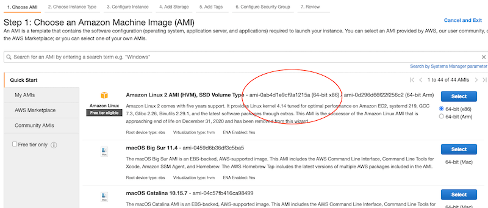

There are lots of pre-baked applications that let you set up Docker quickly, but many of them involve click-ops and don't allow you to save your infrastructure as repeatable code.

This tutorial will show you how to get an EC2 instance (or many) up and running with Docker installed in a repeatable, and stateful way.

## Configuring the AWS provider

Within your project directory (I'm partial to creating a separate infrastructure folder for my Terraform files) create a `main.tf` file. This file will contain our AWS provider.

Think of the provider as the software that communicates with an outside party, in this case, the AWS API. There are a few ways of passing environment variables into Terraform for AWS, but I've found the simplest is to just load a configuration file into your AWS provider.

To do this, you'll need to save your AWS user's credentials to your local computer. Your configuration might look something like this:

```text:title=~/.aws/credentials
[terraform]
aws_access_key_id=KLUHSUIDFB8972D989FSD92
aws_secret_access_key=fj9f&SDKsdfbsdlahsdf

[another-user]
aws_access_key_id=IUSI9UHFK971BA19
aws_secret_access_key=ksdfjn9sf91nfuwof
```

You can then load those credentials into your provider:

```hcl:title=infrastructure/main.tf
provider "aws" {
  region = "us-east-1"
  shared_credentials_file = "~/.aws/credentials"
  profile = "terraform"
}
```

The "profile" will tell Terraform which user to use when communicating with AWS. Make sure the user has programatic access to AWS!

## Setting up our Variables

There are certain parts of this configuration that can be easily pulled into variables, like the SSH keys and the size of the EC2 instance. This will let us modify them in the future if needed. Let's do that now.

Create a file to declare all of your variables. 

```hcl:title=infrastructure/variables.tf
variable "availability_zone" {
  description = "Availability zone of resources"
  type        = string
}

variable "instance_ami" {
  description = "ID of the AMI used"
  type        = string
}

variable "instance_type" {
  description = "Type of the instance"
  type        = string
}

variable "ssh_public_key" {
  description = "Public SSH key for logging into EC2 instance"
  type        = string
}
```

Then create a separate file (which you will _not_ commit to source code) that contains your values for each of these variables. This file is called `terraform.tfvars` and Terraform will pick it up automatically and initialize the variables inside of it.

```hcl:title=infrastructure/terraform.tfvars
availability_zone = "us-east-1a"
instance_ami = "ami-09e67e426f25ce0d7"
instance_type = "t2.micro"
ssh_public_key = "ssh-rsa AAAAB3NzaC1yc2EAAAADAQABAAABAQDQy/pHHnlxKiTFRH/FAbAgtLA2GBS45bTNxrrSP+tqtF0TSe1j/NSKD3+C7GPmVNTOU2SDL3UIu71EfNcDtjRZ9O7AhJvNczOHRQ/gK7Pi88tkVjs5jHImJK3Fx/GgJ1jXCSfR5eD9CAhGBeYS21aq9SCOPDEzY3Pie0pP/KODnCILcdlbX9vVHf/LXXzY41dWEfobuAOjiJ03YjPhPCNCpl2axO0kLPOvkXTkiA8vrn2CpHW/0sy+a2WwaHEJrJ2QARdhrTIi6w8dQWK8AE5xp/vuiTTHCInY04e19m9CZwRi/TbUsyttVaw4DgG9mozxvu7CeC0FLJWE1JGHLBn/ harrisoncramer@myPc.local"
```

The `instance_ami` for the specific EC2 server you'd like to use by logging onto AWS, and launching a new EC2 instance. For me, it looks like this:



## Creating the EC2 Instance


## Creating the Network

Our EC2 servers will need to live inside of a network. In AWS parlance, this is the VPC, or virtual private cloud. Let's create it:

```hcl:title=infrastructure/network.tf
resource "aws_vpc" "main" {
  cidr_block           = "10.0.0.0/16"
  enable_dns_hostnames = true
  enable_dns_support   = true
  tags = {
    Name = "EC2 + Docker VPC"
  }
}
```

The full list of options for the VPC is <a href="https://registry.terraform.io/providers/hashicorp/aws/latest/docs/resources/vpc">here.</a> Basically, we're telling our VPC that we want to enable domain name support (perhaps we want to have this in the future). We're also telling our VPC that our network will have a CIDR block with suppport for 65,534 hosts, ranging between the IP addresses of 10.0.0.1 to 10.0.255.254. To learn more about subnetting and CIDR blocks, check out <a href="https://cloudacademy.com/course/aws-virtual-private-cloud-subnets-and-routing/vpc-cidr-blocks/">this</a> introduction video on the topic.

We'll also need to create our Elastic IP resource. The IP address is a static address that _will not change_. This lets us 
